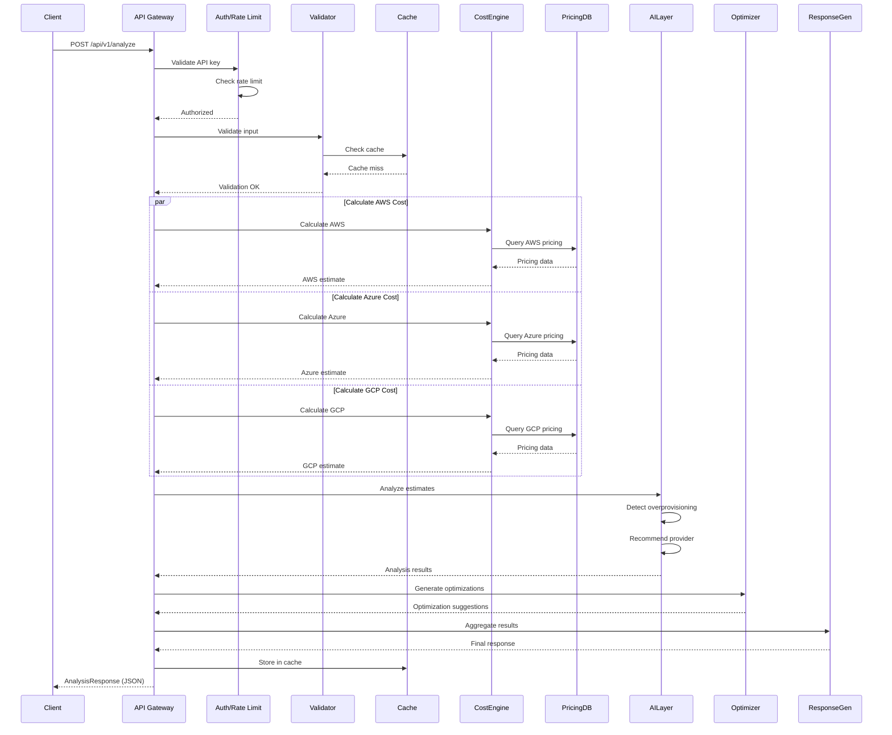
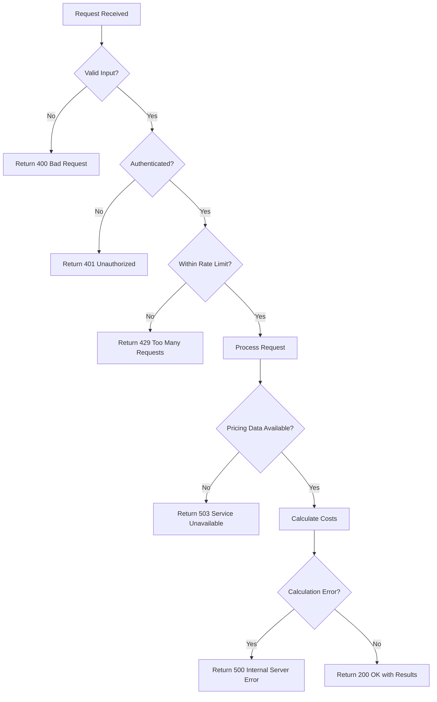

# AI Cloud Deployment Advisor — Architecture

## Architecture Overview

The system acts as an AI consultant before deployment.

User → Input → AI Analysis → Recommendation → Deploy

Instead of monitoring cloud costs after deployment,
the system prevents incorrect architecture decisions.

---

## Layered Architecture

### Presentation Layer
Web dashboard where user enters workload configuration.

### API Layer
Handles requests and validation.

### AI Reasoning Layer
- Workload classification
- Optimization detection
- Provider evaluation

### Cost Engine
Calculates multi-cloud pricing.

## Data Flow Patterns

### Request Processing Flow

### Error Handling Flow

