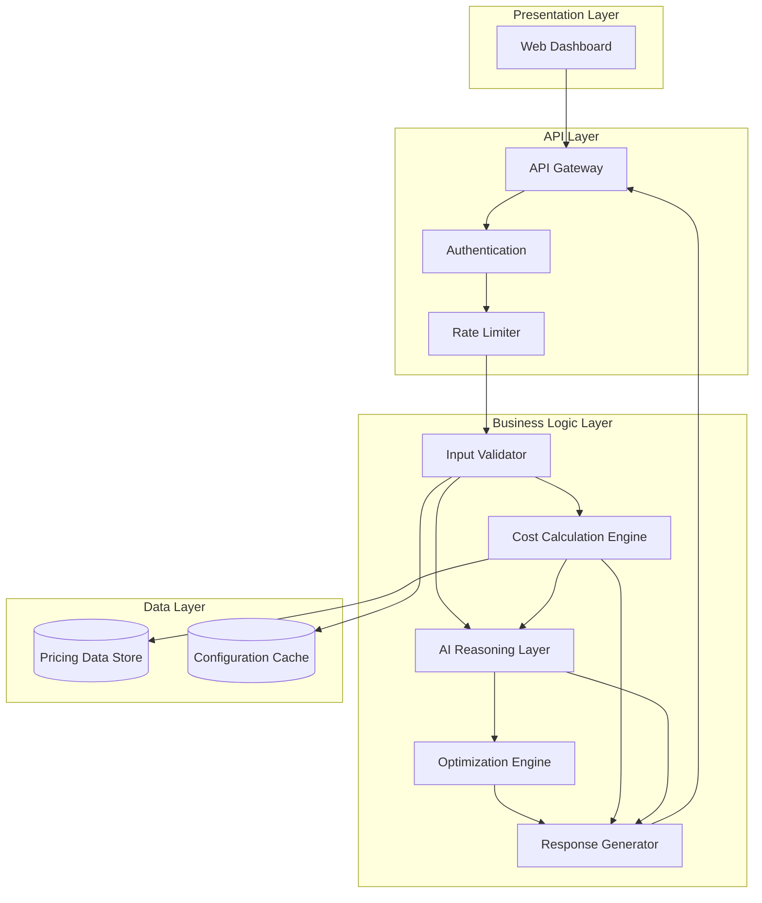
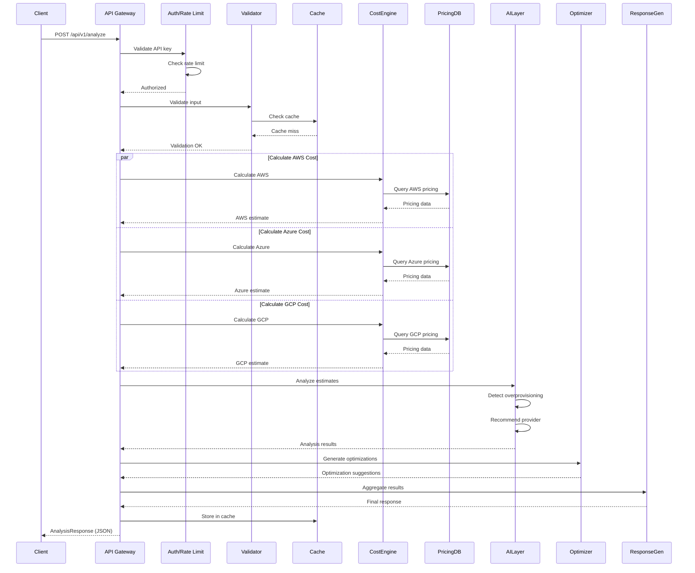
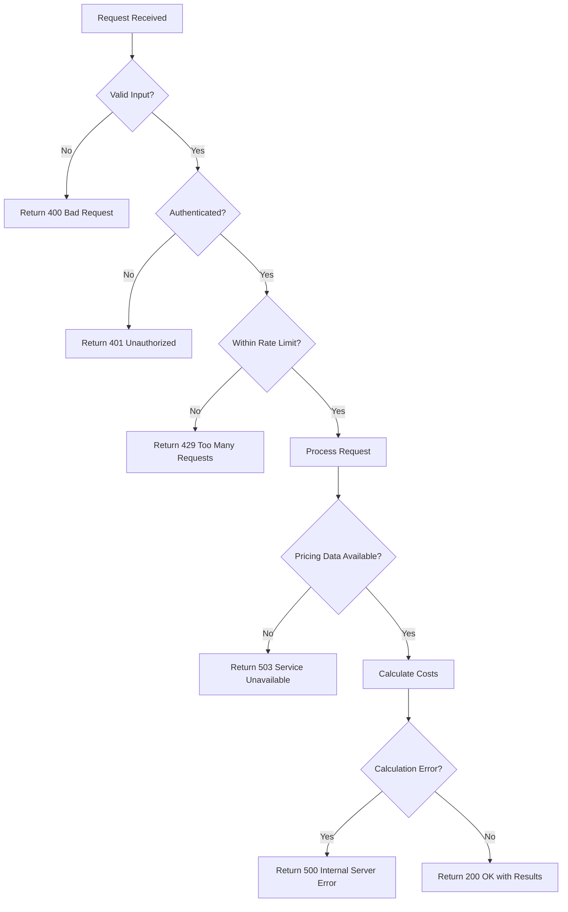
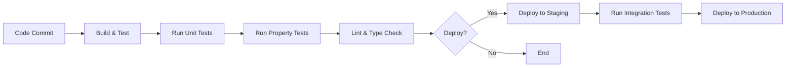

# AI Cloud Deployment Advisor - System Architecture

## Executive Summary

AI Cloud Deployment Advisor is an AI-powered cloud cost advisor that provides intelligent, pre-deployment cost analysis across AWS, Azure, and GCP. The system combines real-time pricing data with AI-driven workload analysis to deliver actionable cost optimization recommendations before infrastructure deployment.

## Architecture Overview

### High-Level Architecture

The system follows a layered architecture pattern with clear separation of concerns:



### Architecture Principles

1. **Separation of Concerns**: Each component has a single, well-defined responsibility
2. **Loose Coupling**: Components interact through well-defined interfaces
3. **High Cohesion**: Related functionality is grouped together
4. **Extensibility**: New cloud providers can be added without modifying existing code
5. **Testability**: All components can be tested independently
6. **Performance**: Caching and parallel processing for fast response times

## Component Architecture

### 1. Presentation Layer

#### Web Dashboard

**Purpose:** Provides user interface for workload configuration and results visualization

**Responsibilities:**
- Collect workload configuration inputs from users
- Validate input formats client-side for immediate feedback
- Display cost comparisons across providers with interactive charts
- Present optimization recommendations in prioritized order
- Show AI reasoning explanations in clear, readable format
- Handle user interactions (form submission, result filtering, export)

**Technology Stack:**
- Frontend Framework: React or Vue.js
- Charting Library: Chart.js or D3.js
- State Management: Redux or Vuex
- HTTP Client: Axios

**Key Features:**
- Responsive design for desktop and mobile
- Real-time input validation
- Interactive cost comparison charts
- Collapsible sections for detailed explanations
- Export results to PDF or JSON

### 2. API Layer

#### API Gateway

**Purpose:** Central entry point for all client requests

**Responsibilities:**
- Route requests to appropriate backend services
- Handle CORS for web-based clients
- Return structured JSON responses
- Manage API versioning
- Log all requests for monitoring and debugging

**Endpoints:**

```
POST /api/v1/analyze
  - Submit workload configuration for analysis
  - Request body: WorkloadConfiguration
  - Response: AnalysisResponse

GET /api/v1/health
  - Health check endpoint
  - Response: { status: "healthy", version: "1.0.0" }

GET /api/v1/regions
  - List supported regions for all providers
  - Response: { aws: [...], azure: [...], gcp: [...] }

GET /api/v1/pricing/status
  - Get pricing data freshness status
  - Response: { lastUpdated: "2024-01-15", providers: [...] }
```

#### Authentication & Authorization

**Purpose:** Secure API access and track usage

**Responsibilities:**
- Validate API keys or JWT tokens
- Track usage per user/organization
- Enforce access control policies

**Implementation:**
- API key-based authentication for simplicity
- Optional OAuth 2.0 for enterprise deployments
- Rate limiting per API key

#### Rate Limiter

**Purpose:** Prevent abuse and ensure fair resource allocation

**Responsibilities:**
- Limit requests per API key (e.g., 100 requests/hour)
- Return 429 Too Many Requests when limit exceeded
- Include Retry-After header in rate limit responses

**Implementation:**
- Token bucket algorithm
- Redis-based distributed rate limiting for horizontal scaling

### 3. Business Logic Layer

#### Input Validator

**Purpose:** Ensure all workload configurations meet system requirements

**Responsibilities:**
- Validate presence of all required fields
- Check data types and value ranges
- Normalize units (MB/GB, ms/s/min) to standard format
- Validate region codes against supported regions
- Return descriptive error messages for invalid inputs

**Validation Rules:**

| Parameter | Type | Range | Units |
|-----------|------|-------|-------|
| memoryMB | integer | 128 - 10240 | MB |
| executionTimeMs | integer | 1 - 900000 | ms |
| requestCount | integer | 1 - 1000000000 | count/month |
| storageGB | number | 0 - 10000 | GB |
| serviceType | enum | serverless, compute | - |
| region | string | Valid AWS/Azure/GCP region | - |

**Error Handling:**
- Collect all validation errors before returning
- Provide field-specific error messages
- Suggest corrections when possible

#### Cost Calculation Engine

**Purpose:** Calculate accurate cost estimates for all cloud providers

**Responsibilities:**
- Query pricing data for specified provider, service, and region
- Calculate compute costs based on memory and execution time
- Calculate request costs based on request count
- Calculate storage costs based on storage allocation
- Apply regional pricing multipliers
- Generate daily, monthly, and yearly projections
- Support both serverless and compute service types

**Cost Calculation Formulas:**

**Serverless (Lambda/Functions):**
```
computeCost = (memoryGB × executionSeconds × requestCount) × pricePerGBSecond
requestCost = requestCount × pricePerMillionRequests / 1,000,000
storageCost = storageGB × pricePerGBMonth
totalMonthlyCost = computeCost + requestCost + storageCost
```

**Compute (EC2/VMs):**
```
instanceType = selectInstanceType(memoryMB)
computeCost = instanceHourlyRate × 730 hours/month
storageCost = storageGB × pricePerGBMonth
totalMonthlyCost = computeCost + storageCost
```

**Time Projections:**
```
dailyCost = monthlyCost / 30
yearlyCost = monthlyCost × 12
```

**Provider-Specific Calculations:**

**AWS Lambda:**
- Free tier: 1M requests/month, 400,000 GB-seconds/month
- Pricing: $0.20 per 1M requests, $0.0000166667 per GB-second
- Regional multipliers: us-east-1 (1.0x), eu-west-1 (1.1x), ap-southeast-1 (1.15x)

**Azure Functions:**
- Free tier: 1M requests/month, 400,000 GB-seconds/month
- Pricing: $0.20 per 1M requests, $0.000016 per GB-second
- Regional multipliers: East US (1.0x), West Europe (1.08x), Southeast Asia (1.12x)

**GCP Cloud Functions:**
- Free tier: 2M requests/month, 400,000 GB-seconds/month
- Pricing: $0.40 per 1M requests, $0.0000025 per GB-second
- Regional multipliers: us-central1 (1.0x), europe-west1 (1.09x), asia-southeast1 (1.14x)

**Parallel Processing:**
- Calculate costs for all three providers in parallel
- Use Promise.all() or equivalent for concurrent execution
- Timeout after 5 seconds if pricing data unavailable

#### AI Reasoning Layer

**Purpose:** Provide intelligent analysis and recommendations based on workload patterns

**Responsibilities:**
- Analyze workload patterns to detect overprovisioning
- Compare cost estimates across providers
- Recommend the most cost-effective provider
- Generate natural language explanations for all recommendations
- Identify optimization opportunities
- Apply machine learning models for pattern recognition (future enhancement)

**Core Intelligence Components:**

**1. Overprovisioning Detector**

Analyzes resource allocation against workload patterns to identify waste:

```typescript
interface OverprovisioningRules {
  // Memory overprovisioning
  memoryThresholds: {
    lowTraffic: { requestsPerDay: 1000, maxMemoryMB: 512 },
    mediumTraffic: { requestsPerDay: 10000, maxMemoryMB: 1024 },
    highTraffic: { requestsPerDay: 100000, maxMemoryMB: 2048 }
  },
  
  // Execution time overprovisioning
  executionTimeThresholds: {
    serverless: { maxMs: 60000 },  // 60s for serverless
    compute: { maxMs: 900000 }      // 15min for compute
  },
  
  // Storage overprovisioning
  storageThresholds: {
    lowUsage: { requestsPerDay: 1000, maxStorageGB: 10 },
    mediumUsage: { requestsPerDay: 10000, maxStorageGB: 100 }
  }
}
```

**Detection Algorithm:**
1. Calculate requests per day from monthly request count
2. Classify workload as low/medium/high traffic
3. Compare memory allocation against threshold for traffic level
4. Compare execution time against service type threshold
5. Compare storage against usage pattern threshold
6. Flag resources exceeding thresholds by >20%
7. Calculate potential savings from right-sizing

**2. Provider Recommender**

Selects the optimal cloud provider based on cost and other factors:

```typescript
interface RecommendationLogic {
  // Primary criterion: Total cost
  selectLowestCost(estimates: CostEstimate[]): Provider
  
  // Tie-breaking logic (when costs within 5%)
  tieBreaker(similarProviders: Provider[]): Provider {
    // Consider:
    // 1. Regional availability (prefer provider with more regions)
    // 2. Service maturity (AWS > Azure > GCP for serverless)
    // 3. Free tier benefits (GCP has highest free tier)
    // 4. Ecosystem compatibility (if user has existing infrastructure)
  }
  
  // Cost difference calculation
  calculateSavings(recommended: CostEstimate, alternatives: CostEstimate[]): number
}
```

**Recommendation Algorithm:**
1. Sort providers by total monthly cost (ascending)
2. If lowest cost provider is >5% cheaper than second → recommend lowest
3. If costs within 5% → apply tie-breaking logic
4. Calculate cost difference vs most expensive provider
5. Generate explanation comparing all three providers

**3. Explanation Generator**

Produces natural language explanations for all recommendations:

```typescript
interface ExplanationTemplates {
  costEstimate: (config: WorkloadConfig, estimate: CostEstimate) => string
  overprovisioning: (analysis: OverprovisioningAnalysis) => string
  providerRecommendation: (recommendation: ProviderRecommendation) => string
  optimization: (suggestion: OptimizationSuggestion) => string
}
```

**Example Explanations:**

**Cost Estimate:**
```
"Based on your configuration (512MB memory, 200ms execution time, 100,000 requests/month), 
AWS Lambda will cost approximately $8.50/month. This includes $6.40 for compute 
(512MB × 0.2s × 100,000 requests), $2.00 for requests (100,000 × $0.20/1M), 
and $0.10 for storage (1GB × $0.10/GB)."
```

**Overprovisioning:**
```
"Your configuration appears overprovisioned. With 100,000 requests/month (3,333/day), 
2GB memory allocation is excessive. Similar workloads typically use 512MB-1GB. 
Right-sizing to 1GB could save approximately $4.20/month (49% reduction)."
```

**Provider Recommendation:**
```
"We recommend GCP Cloud Functions for this workload. At $7.20/month, it's 15% cheaper 
than AWS Lambda ($8.50/month) and 22% cheaper than Azure Functions ($9.20/month). 
GCP also offers a more generous free tier (2M requests vs 1M), which could eliminate 
costs entirely for development/testing environments."
```

**4. Pattern Recognition Engine**

Identifies workload patterns and suggests architectural improvements:

```typescript
interface WorkloadPatterns {
  // Batch processing pattern
  batchPattern: {
    detect: (config: WorkloadConfig) => boolean,
    suggestion: "Consider scheduled execution to reduce costs by 40-60%"
  },
  
  // High-frequency pattern
  highFrequencyPattern: {
    detect: (config: WorkloadConfig) => boolean,
    suggestion: "Consider reserved instances for predictable workloads"
  },
  
  // Read-heavy pattern
  readHeavyPattern: {
    detect: (config: WorkloadConfig) => boolean,
    suggestion: "Consider adding caching layer (Redis/Memcached) to reduce compute costs"
  },
  
  // Long-running pattern
  longRunningPattern: {
    detect: (config: WorkloadConfig) => boolean,
    suggestion: "Consider switching from serverless to compute instances"
  }
}
```

**Pattern Detection Rules:**
- Batch: Low request count (<1000/day), long execution time (>5min)
- High-frequency: High request count (>100,000/day), consistent traffic
- Read-heavy: High request count, low execution time (<100ms)
- Long-running: Execution time >15min for serverless

#### Optimization Engine

**Purpose:** Generate actionable optimization suggestions with quantified cost impact

**Responsibilities:**
- Suggest alternative service types (serverless ↔ compute)
- Recommend alternative regions for cost savings
- Propose resource configuration adjustments
- Identify architectural patterns for cost reduction
- Quantify expected cost impact for each suggestion
- Prioritize suggestions by potential savings

**Optimization Strategies:**

**1. Service Type Optimization**

```typescript
function suggestServiceTypeSwitch(
  config: WorkloadConfig,
  estimates: CostEstimate[]
): OptimizationSuggestion | null {
  if (config.serviceType === 'serverless' && config.executionTimeMs > 900000) {
    // Serverless execution time > 15min → suggest compute
    const computeEstimate = calculateComputeCost(config);
    const serverlessEstimate = estimates.find(e => e.service.includes('Lambda'));
    const savings = serverlessEstimate.monthlyCost - computeEstimate.monthlyCost;
    
    if (savings > 0) {
      return {
        type: 'service_type',
        description: 'Switch from serverless to compute instances',
        currentConfig: { serviceType: 'serverless' },
        suggestedConfig: { serviceType: 'compute' },
        estimatedSavings: savings,
        reasoning: `Long execution times (${config.executionTimeMs}ms) are more cost-effective on compute instances. Estimated savings: $${savings.toFixed(2)}/month.`
      };
    }
  }
  return null;
}
```

**2. Region Optimization**

```typescript
function suggestRegionSwitch(
  config: WorkloadConfig,
  pricingData: PricingModel[]
): OptimizationSuggestion | null {
  const currentRegionCost = calculateCost(config, config.region);
  const allRegionCosts = pricingData.map(pricing => ({
    region: pricing.region,
    cost: calculateCost(config, pricing.region)
  }));
  
  const cheapestRegion = allRegionCosts.sort((a, b) => a.cost - b.cost)[0];
  const savings = currentRegionCost - cheapestRegion.cost;
  
  if (savings > currentRegionCost * 0.1) {  // >10% savings
    return {
      type: 'region',
      description: `Switch from ${config.region} to ${cheapestRegion.region}`,
      currentConfig: { region: config.region },
      suggestedConfig: { region: cheapestRegion.region },
      estimatedSavings: savings,
      reasoning: `Region ${cheapestRegion.region} offers ${(savings/currentRegionCost*100).toFixed(0)}% lower pricing for this workload.`
    };
  }
  return null;
}
```

**3. Resource Configuration Optimization**

```typescript
function suggestResourceAdjustment(
  config: WorkloadConfig,
  overprovisioningAnalysis: OverprovisioningAnalysis
): OptimizationSuggestion[] {
  const suggestions: OptimizationSuggestion[] = [];
  
  if (overprovisioningAnalysis.overprovisionedResources.includes('memory')) {
    const suggestedMemory = Math.ceil(config.memoryMB * 0.5);  // Reduce by 50%
    const currentCost = calculateCost(config, config.region);
    const optimizedCost = calculateCost({...config, memoryMB: suggestedMemory}, config.region);
    
    suggestions.push({
      type: 'resource_config',
      description: `Reduce memory allocation from ${config.memoryMB}MB to ${suggestedMemory}MB`,
      currentConfig: { memoryMB: config.memoryMB },
      suggestedConfig: { memoryMB: suggestedMemory },
      estimatedSavings: currentCost - optimizedCost,
      reasoning: `Memory allocation appears excessive for this workload pattern. Right-sizing can reduce costs without impacting performance.`
    });
  }
  
  return suggestions;
}
```

**4. Architectural Pattern Optimization**

```typescript
function suggestArchitecturalPatterns(
  config: WorkloadConfig
): OptimizationSuggestion[] {
  const suggestions: OptimizationSuggestion[] = [];
  
  // Caching suggestion for read-heavy workloads
  if (config.requestCount > 100000 && config.executionTimeMs < 100) {
    suggestions.push({
      type: 'architecture',
      description: 'Add caching layer (Redis/Memcached)',
      currentConfig: { architecture: 'direct' },
      suggestedConfig: { architecture: 'cached' },
      estimatedSavings: config.requestCount * 0.7 * 0.00002,  // 70% cache hit rate
      reasoning: 'High request volume with fast execution suggests read-heavy workload. Caching can reduce compute costs by 60-80%.'
    });
  }
  
  // Batching suggestion for batch workloads
  if (config.requestCount < 1000 && config.executionTimeMs > 300000) {
    suggestions.push({
      type: 'architecture',
      description: 'Use scheduled batch processing',
      currentConfig: { execution: 'on-demand' },
      suggestedConfig: { execution: 'scheduled' },
      estimatedSavings: calculateCost(config, config.region) * 0.5,
      reasoning: 'Low-frequency, long-running workload is ideal for scheduled batch processing, which can reduce costs by 40-60%.'
    });
  }
  
  return suggestions;
}
```

#### Response Generator

**Purpose:** Aggregate results from all components into a structured response

**Responsibilities:**
- Collect cost estimates from Cost Engine
- Collect analysis from AI Reasoning Layer
- Collect suggestions from Optimization Engine
- Format data for API response
- Ensure all required fields are present
- Add metadata (timestamp, version)

**Response Structure:**

```typescript
interface AnalysisResponse {
  // Cost estimates for all providers
  estimates: [
    {
      provider: 'AWS',
      service: 'Lambda',
      dailyCost: 0.28,
      monthlyCost: 8.50,
      yearlyCost: 102.00,
      breakdown: {
        computeCost: 6.40,
        storageCost: 0.10,
        requestCost: 2.00,
        dataTransferCost: 0.00
      }
    },
    // ... Azure, GCP
  ],
  
  // Provider recommendation
  recommendation: {
    recommendedProvider: 'GCP',
    costDifference: 2.00,  // Savings vs most expensive
    reasoning: 'GCP Cloud Functions offers the lowest cost...'
  },
  
  // Overprovisioning analysis
  overprovisioning: {
    isOverprovisioned: true,
    overprovisionedResources: ['memory'],
    potentialSavings: 4.20,
    explanation: 'Your configuration appears overprovisioned...'
  },
  
  // Optimization suggestions (sorted by savings)
  optimizations: [
    {
      type: 'resource_config',
      description: 'Reduce memory allocation from 2048MB to 1024MB',
      currentConfig: { memoryMB: 2048 },
      suggestedConfig: { memoryMB: 1024 },
      estimatedSavings: 4.20,
      reasoning: 'Memory allocation appears excessive...'
    },
    // ... more suggestions
  ],
  
  // Overall explanation
  explanation: 'Based on your workload configuration...',
  
  // Metadata
  timestamp: '2024-01-15T10:30:00Z',
  version: '1.0.0'
}
```

### 4. Data Layer

#### Pricing Data Store

**Purpose:** Maintain up-to-date pricing information for all cloud providers

**Responsibilities:**
- Store pricing models for all supported services
- Support efficient querying by provider, service, region
- Allow updates without code changes
- Track pricing data freshness
- Provide fallback pricing when data unavailable

**Data Structure:**

```json
{
  "provider": "AWS",
  "serviceType": "serverless",
  "service": "Lambda",
  "regions": {
    "us-east-1": {
      "computePerGBSecond": 0.0000166667,
      "requestPer1M": 0.20,
      "storagePerGBMonth": 0.10,
      "dataTransferPerGB": 0.09,
      "freeTier": {
        "requests": 1000000,
        "computeGBSeconds": 400000
      }
    },
    "eu-west-1": {
      "computePerGBSecond": 0.0000183333,
      "requestPer1M": 0.22,
      "storagePerGBMonth": 0.11,
      "dataTransferPerGB": 0.09
    }
  },
  "lastUpdated": "2024-01-15T00:00:00Z",
  "source": "https://aws.amazon.com/lambda/pricing/"
}
```

**Storage Options:**
- JSON files for simplicity (suitable for hackathon/MVP)
- MongoDB/PostgreSQL for production (better querying, versioning)
- Redis cache for frequently accessed pricing data

**Update Mechanism:**
- Manual updates via JSON file replacement
- Automated updates via pricing API scraping (future enhancement)
- Version control for pricing data changes

#### Configuration Cache

**Purpose:** Cache validated configurations for faster repeated analysis

**Responsibilities:**
- Store validated and normalized configurations
- Provide fast lookup for repeated requests
- Implement TTL (time-to-live) for cache entries
- Reduce validation overhead

**Implementation:**
- In-memory cache (Node.js: node-cache, Python: cachetools)
- Redis for distributed caching in production
- Cache key: hash of workload configuration
- TTL: 1 hour

## Data Flow Patterns

### Request Processing Flow



### Error Handling Flow



## Scalability & Performance

### Performance Targets

- API response time: <500ms (p95)
- Concurrent requests: 100 requests/second
- Pricing data query: <10ms
- Cost calculation: <100ms per provider
- Total analysis time: <400ms

### Scalability Strategies

**Horizontal Scaling:**
- Stateless API servers (can add more instances)
- Load balancer distributes requests across instances
- Shared Redis cache for distributed caching
- Shared database for pricing data

**Caching Strategy:**
- Cache validated configurations (1 hour TTL)
- Cache pricing data queries (24 hour TTL)
- Cache cost calculations for identical configs (1 hour TTL)

**Parallel Processing:**
- Calculate costs for all three providers in parallel
- Use Promise.all() or equivalent for concurrent execution
- Timeout after 5 seconds if provider calculation hangs

**Database Optimization:**
- Index pricing data by provider, service, region
- Use connection pooling for database queries
- Implement read replicas for high-traffic scenarios

### Monitoring & Observability

**Metrics to Track:**
- Request rate (requests/second)
- Response time (p50, p95, p99)
- Error rate (4xx, 5xx)
- Cache hit rate
- Pricing data freshness
- Cost calculation accuracy

**Logging:**
- Log all API requests with request ID
- Log validation errors with details
- Log calculation errors with stack traces
- Log pricing data updates

**Alerting:**
- Alert on error rate >5%
- Alert on response time >1s (p95)
- Alert on pricing data >30 days old
- Alert on cache hit rate <50%

## Security Considerations

### API Security

**Authentication:**
- API key-based authentication
- Keys stored securely (hashed, not plaintext)
- Support key rotation

**Rate Limiting:**
- Prevent abuse and DDoS attacks
- 100 requests/hour per API key (configurable)
- Return 429 with Retry-After header

**Input Validation:**
- Validate all inputs server-side
- Sanitize inputs to prevent injection attacks
- Reject oversized payloads (>1MB)

### Data Security

**Pricing Data:**
- Pricing data is public information (no sensitive data)
- Store in version control for auditability
- Validate pricing data integrity on load

**User Data:**
- Do not store user workload configurations long-term
- Cache only for performance (1 hour TTL)
- No PII collected or stored

**HTTPS:**
- All API communication over HTTPS
- TLS 1.2 or higher
- Valid SSL certificates

## Deployment Architecture

### Development Environment

```
Local Machine
├── Frontend (React Dev Server, Port 3000)
├── Backend (Node.js/Express, Port 8080)
└── Pricing Data (JSON files in /data)
```

### Production Environment

```
Cloud Infrastructure (AWS/Azure/GCP)
├── Load Balancer (HTTPS termination)
├── API Servers (Auto-scaling group, 2-10 instances)
├── Redis Cache (Managed service)
├── Database (Managed PostgreSQL/MongoDB)
├── Static Assets (CDN for frontend)
└── Monitoring (CloudWatch/Azure Monitor/Stackdriver)
```

### CI/CD Pipeline



## Future Enhancements

### Phase 2: Machine Learning Integration

- Train ML models on historical workload data
- Predict actual resource usage vs allocated resources
- Improve overprovisioning detection accuracy
- Personalized recommendations based on user patterns

### Phase 3: Multi-Cloud Optimization

- Support for hybrid cloud deployments
- Cross-provider data transfer cost analysis
- Multi-region deployment optimization
- Disaster recovery cost analysis

### Phase 4: Real-Time Monitoring Integration

- Connect to actual cloud accounts
- Analyze real usage vs predictions
- Alert on cost anomalies
- Automated cost optimization recommendations

### Phase 5: Team Collaboration

- Shared workload configurations
- Team-wide cost optimization goals
- Cost allocation by team/project
- Approval workflows for deployments

## Conclusion

AI Cloud Deployment Advisor provides a robust, scalable architecture for AI-powered cloud cost analysis. The layered architecture ensures separation of concerns, testability, and extensibility. The AI Reasoning Layer delivers intelligent recommendations that help developers make informed infrastructure decisions before deployment, potentially saving thousands of dollars in cloud costs.

The system is designed for rapid development (suitable for hackathon timeline) while maintaining production-ready architecture principles that support future growth and enhancement.

